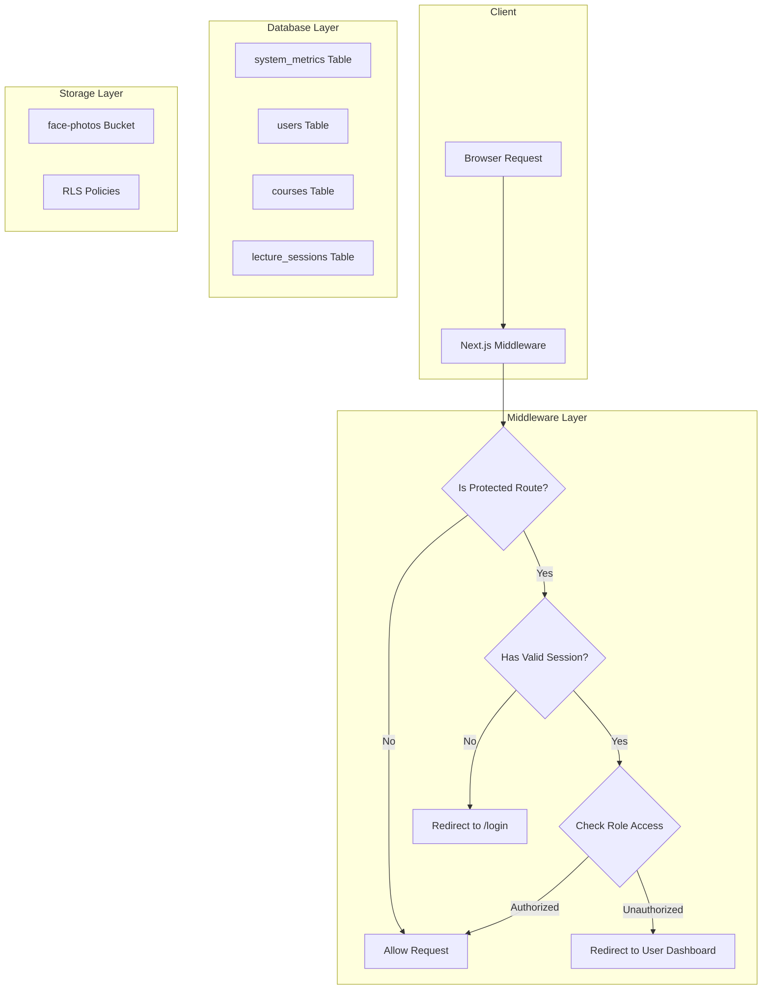

# Design Document

## Overview

This design addresses three critical security and functionality issues in the FaceCheck attendance system:
1. Missing route protection middleware
2. Missing system_metrics table causing admin dashboard failures
3. Missing face-photos storage bucket preventing face enrollment

The solution uses Next.js middleware for route protection, Supabase for database and storage, and follows the existing codebase patterns.

## Architecture



## Components and Interfaces

### 1. Middleware Component (`middleware.ts`)

The middleware intercepts all requests and handles authentication/authorization.

```typescript
// middleware.ts
import { createServerClient } from '@supabase/ssr'
import { NextResponse, type NextRequest } from 'next/server'

interface RouteConfig {
  publicRoutes: string[]
  protectedRoutes: {
    student: string[]
    lecturer: string[]
    admin: string[]
  }
}

export async function middleware(request: NextRequest): Promise<NextResponse>
```

**Key Functions:**
- `getSession()`: Retrieves current user session from Supabase
- `getUserRole()`: Fetches user role from the users table
- `isPublicRoute()`: Checks if the current path is publicly accessible
- `getAuthorizedRedirect()`: Returns the appropriate dashboard URL for a role

### 2. Admin Dashboard Updates (`app/admin/dashboard/page.tsx`)

Replace the system_metrics query with direct table counts.

```typescript
interface DashboardStats {
  totalUsers: number
  activeSessions: number
  totalCourses: number
  avgAttendance: number
}

async function fetchDashboardStats(): Promise<DashboardStats>
```

### 3. Storage Migration Script

SQL script to create the face-photos bucket with proper RLS policies.

```sql
-- Create storage bucket
INSERT INTO storage.buckets (id, name, public)
VALUES ('face-photos', 'face-photos', true);

-- RLS policies for the bucket
CREATE POLICY "Users can upload own photos"
ON storage.objects FOR INSERT
WITH CHECK (bucket_id = 'face-photos' AND auth.uid()::text = (storage.foldername(name))[1]);
```

### 4. Login Page Updates (`app/(auth)/login/page.tsx`)

Update the redirect logic to handle all user roles.

```typescript
function getRedirectPath(role: string): string {
  switch (role) {
    case 'admin':
    case 'hod':
      return '/admin/dashboard'
    case 'lecturer':
      return '/lecturer/dashboard'
    default:
      return '/student/dashboard'
  }
}
```

## Data Models

### System Metrics Table (Optional - for future use)

```sql
CREATE TABLE public.system_metrics (
  id TEXT PRIMARY KEY,
  metric_name TEXT NOT NULL,
  value NUMERIC DEFAULT 0,
  updated_at TIMESTAMP WITH TIME ZONE DEFAULT NOW()
);
```

### Storage Bucket Configuration

| Property | Value |
|----------|-------|
| Bucket ID | face-photos |
| Public | true (for profile display) |
| File Size Limit | 5MB |
| Allowed MIME Types | image/jpeg, image/png, image/webp |


## Correctness Properties

*A property is a characteristic or behavior that should hold true across all valid executions of a system—essentially, a formal statement about what the system should do. Properties serve as the bridge between human-readable specifications and machine-verifiable correctness guarantees.*

### Property 1: Unauthenticated Access Redirect

*For any* request to a protected route (`/student/*`, `/lecturer/*`, `/admin/*`) without a valid session, the middleware should redirect to `/login`.

**Validates: Requirements 1.1, 1.2, 1.3**

### Property 2: Role-Based Access Control

*For any* authenticated user attempting to access a route restricted to a different role, the middleware should redirect them to their own dashboard (students to `/student/dashboard`, lecturers to `/lecturer/dashboard`).

**Validates: Requirements 1.4, 1.5, 1.6**

### Property 3: Authenticated User Login Redirect

*For any* authenticated user accessing `/login` or `/register`, the middleware should redirect them to their role-appropriate dashboard.

**Validates: Requirements 1.7**

### Property 4: Public Route Access

*For any* request to public routes (`/`, `/login`, `/register`, `/auth/callback`, `/api/*`), the middleware should allow access without authentication.

**Validates: Requirements 1.8**

### Property 5: Dashboard Stats Accuracy

*For any* admin dashboard load, the displayed user count should equal the actual count of rows in the users table, and the course count should equal the actual count of active courses.

**Validates: Requirements 2.3, 2.4, 2.5**

### Property 6: Storage Upload Authorization

*For any* authenticated user uploading to the face-photos bucket, the file should only be stored if the path starts with their user ID.

**Validates: Requirements 3.2, 3.7**

### Property 7: Login Role Redirect

*For any* successful login, the user should be redirected to the dashboard matching their role (admin/hod → `/admin/dashboard`, lecturer → `/lecturer/dashboard`, student → `/student/dashboard`).

**Validates: Requirements 4.1, 4.2, 4.3, 4.4**

## Error Handling

### Middleware Errors
- If session check fails, treat as unauthenticated and redirect to login
- If role lookup fails, redirect to login with error parameter
- Log all middleware errors for debugging

### Admin Dashboard Errors
- If any stats query fails, display 0 with a warning indicator
- Show toast notification for query failures
- Implement retry mechanism for transient failures

### Storage Errors
- If bucket doesn't exist, show clear error message to user
- If upload fails due to size/type, show specific validation error
- Implement client-side validation before upload attempt

## Testing Strategy

### Unit Tests
- Test route matching logic in middleware
- Test role-based redirect logic
- Test stats calculation functions

### Integration Tests
- Test full authentication flow with Supabase
- Test storage upload with RLS policies
- Test admin dashboard data fetching

### Property-Based Tests
- Use fast-check to generate random routes and verify middleware behavior
- Test storage path validation with random user IDs and file paths

### Manual Testing
- Verify redirect behavior in browser
- Test face enrollment upload flow
- Verify admin dashboard displays correct stats
